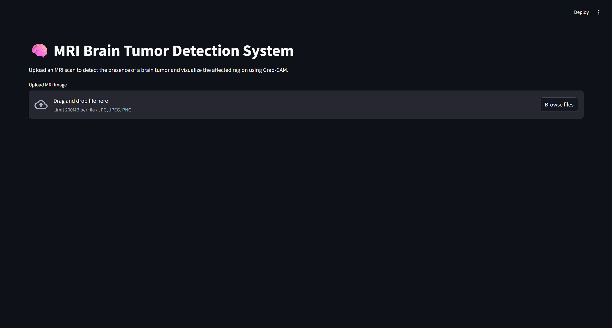
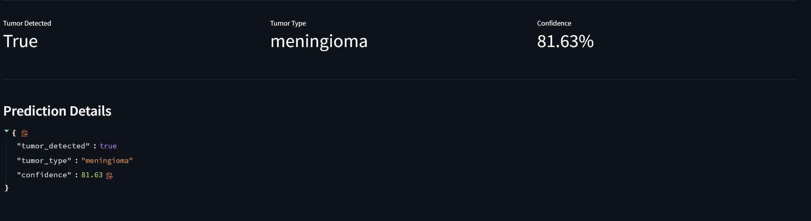
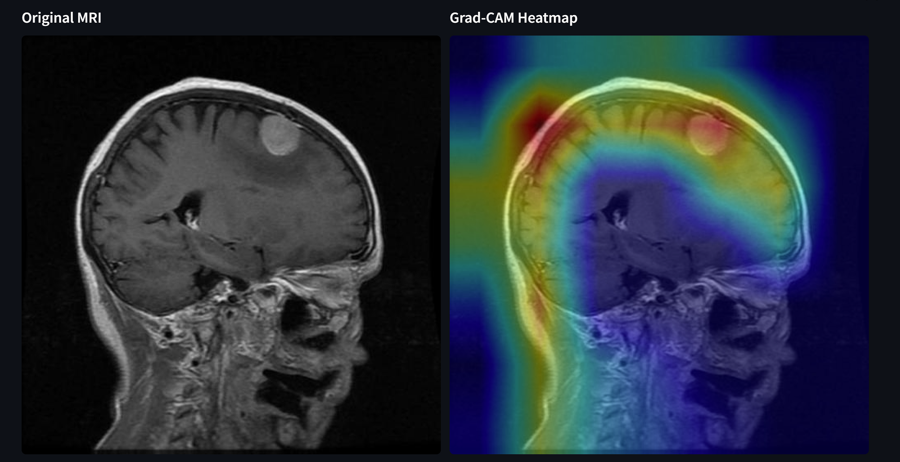

# 🧠 Brain Tumor Detection System

An end-to-end Deep Learning application that detects and classifies brain tumors from MRI scans using **EfficientNetB0** and provides visual explanations through **Grad-CAM**.

The application consists of:

* **FastAPI Backend** for model inference
* **Streamlit Frontend** for user interaction
* **EfficientNetB0-based CNN Model** for classification
* **Grad-CAM Visualization** for explainable AI

---

# 🚀 Features

✅ Brain MRI Classification

✅ Multi-Class Tumor Detection

✅ Grad-CAM Explainability

✅ FastAPI REST API

✅ Streamlit Web Application

✅ Transfer Learning with EfficientNetB0

✅ Confidence Score Prediction

✅ End-to-End ML Pipeline Architecture

---

# 🏥 Tumor Classes

The model classifies MRI scans into four categories:

| Class      | Description                         |
| ---------- | ----------------------------------- |
| Glioma     | Tumor originating from glial cells  |
| Meningioma | Tumor arising from the meninges     |
| Pituitary  | Tumor affecting the pituitary gland |
| No Tumor   | Healthy MRI scan                    |

---

# 🧠 Model Architecture

### Backbone Network

* EfficientNetB0
* Transfer Learning
* TensorFlow / Keras

### Input Specifications

* Input Size: 224 × 224 × 3
* MRI Images
* Multi-Class Classification

### Training Techniques

* Data Augmentation
* Transfer Learning
* Fine-Tuning
* Early Stopping
* Model Checkpointing

---

# 📊 Model Performance

## Test Set Performance

| Metric    | Value |
| --------- | ----- |
| Accuracy  | 87%   |
| Precision | 87%   |
| Recall    | 87%   |
| F1 Score  | 86%   |

## Classification Report

| Class      | Precision | Recall | F1-Score |
| ---------- | --------- | ------ | -------- |
| Glioma     | 0.93      | 0.67   | 0.78     |
| Meningioma | 0.80      | 0.81   | 0.81     |
| No Tumor   | 0.91      | 0.99   | 0.95     |
| Pituitary  | 0.84      | 0.99   | 0.91     |

---

# 🔥 Explainable AI with Grad-CAM

Grad-CAM (Gradient-weighted Class Activation Mapping) is used to highlight the regions of the MRI scan that most influenced the model's prediction.

This improves model interpretability and helps users understand the reasoning behind predictions.

### Example Workflow

```text
MRI Image
    ↓
Model Prediction
    ↓
Grad-CAM Heatmap
    ↓
Highlighted Tumor Region
```

---

# 🏗️ Project Architecture

```text
MRI Scan
    ↓
Streamlit Frontend
    ↓
FastAPI Backend
    ↓
Predict Pipeline
    ↓
EfficientNetB0 Model
    ↓
Prediction + Confidence Score
    ↓
Grad-CAM Visualization
```

---

# 📁 Project Structure

```text
BrainTumorDetector/

├── artifacts/
├── backend/
│   ├── app.py
│   ├── routes.py
│   └── schemas.py
│
├── dataset/
│
├── frontend/
│   └── streamlit_app.py
│
├── models/
│   └── best_model.keras
│
├── src/
│   ├── components/
│   │   ├── data_ingestion.py
│   │   ├── data_transformation.py
│   │   ├── model_trainer.py
│   │   └── gradcam.py
│   │
│   └── pipeline/
│       ├── train_pipeline.py
│       └── predict_pipeline.py
│
├── tests/
│
├── requirements.txt
├── requirements_freeze.txt
├── setup.py
├── README.md
├── LICENSE
└── .gitignore
```

---

# ⚙️ Installation

## Clone Repository

```bash
git clone https://github.com/swagat994/Brain_Tumor_Detection_System.git
cd BrainTumorDetector
```

## Create Virtual Environment

```bash
conda create -n venv python=3.10
conda activate venv
```

## Install Dependencies

```bash
pip install -r requirements.txt
```

## Install Project Package

```bash
pip install -e .
```

---

# ▶️ Running the Backend

Start FastAPI:

```bash
uvicorn backend.app:app --reload
```

API Documentation:

```text
http://127.0.0.1:8000/docs
```

---

# ▶️ Running the Frontend

Start Streamlit:

```bash
streamlit run frontend/streamlit_app.py
```

Application URL:

```text
http://localhost:8501
```

---

# 🔌 API Endpoints

## Prediction Endpoint

```http
POST /predict
```

Returns:

```json
{
  "tumor_detected": true,
  "tumor_type": "glioma",
  "confidence": 92.34
}
```

---

## Grad-CAM Endpoint

```http
POST /gradcam
```

Returns:

* Grad-CAM heatmap image
* Visual explanation of prediction

---

# 🛠️ Technologies Used

### Machine Learning

* TensorFlow
* Keras
* NumPy
* Scikit-Learn

### Computer Vision

* OpenCV
* Pillow

### Backend

* FastAPI
* Uvicorn

### Frontend

* Streamlit

### Data Analysis

* Pandas
* Matplotlib

---

# 📸 Application Screenshots

## Home Page



## Prediction Result



## Grad-CAM Visualization



---

# 🔮 Future Improvements

* DICOM Image Support
* Cloud Deployment
* PDF Medical Report Generation
* User Authentication
* Model Monitoring
* Improved Explainability Techniques

---

# 👨‍💻 Author

**Swagat**

Computer Science Student | Machine Learning Enthusiast

---

# 📜 License

This project is licensed under the MIT License.
